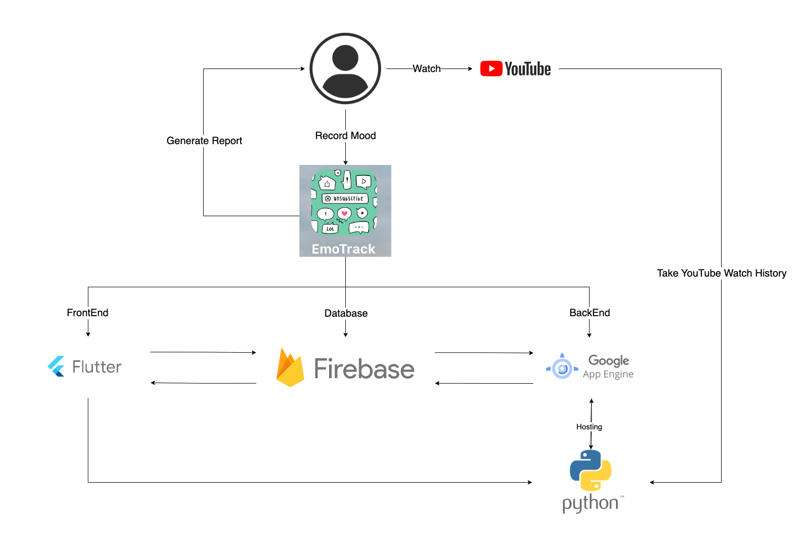

# EmoTrack

[](LICENSE) [](https://flutter.dev) [](https://firebase.google.com) [](https://python.org)

A full-stack, multiplatform Personal Informatics application designed to help users track their YouTube viewing habits, reflect on their emotional responses, and develop healthier online engagement skills.

> **Dissertation Project** – University of Bristol, MEng Computer Science (2024)

---

## ℹ️ Table of Content
- [🎯 Overview](#-overview)
- [✨ Key Features](#-key-features)
- [🧠 Research Foundations](#-research-foundations)
- [🛠️ Technology Stack](#-technology-stack)
- [📁 Project Architecture](#-project-architecture)
- [🚀 Getting Started](#-getting-started)
- [📊 Evaluation & Results](#-evaluation--results)
- [🔮 Future Work & Limitations](#-future-work--limitations)
- [📄 License & Ethics](#-license--ethics)
- [🙏 Acknowledgements](#-acknowledgements)
- [📚 Related Documents](#-related-documents)

---

## 🎯 Overview

**EmoTrack** is a research-driven application that bridges **Human-Computer Interaction (HCI)**, **Personal Informatics**, and **Digital Wellbeing**. It enables users to:

1.  **Record** their mood before and after watching YouTube.
2.  **Upload** and analyse their YouTube watch history.
3.  **Visualise** the relationship between video categories and mood changes through interactive reports.
4.  **Reflect** on their digital habits to foster more mindful and positive online engagement.

The system was evaluated with 13 participants (UK university students), showing **good usability (SUS Score: 79.8)** and demonstrating its effectiveness in facilitating user reflection at multiple levels (R0-R3).

---

## ✨ Key Features

*   **Multiplatform UI:** Built with **Flutter** for seamless iOS, Android, and Web experiences.
*   **Smart Categorisation:** Leverages **OpenAI's ChatGPT (GPT-3.5-turbo)** to automatically categorise YouTube videos beyond YouTube's limited 15 categories.
*   **Automated Data Pipeline:** Backend in **Python (Quart framework)** processes watch history, integrates with the **YouTube Data API**, and manages data flow.
*   **Cloud-Based Infrastructure:** Utilises **Google Firebase** for authentication (Firebase Auth), data storage (Cloud Firestore), file storage (Cloud Storage), and web hosting.
*   **Interactive Visualisation:** Provides daily/weekly bar charts and detailed lists showing video categories correlated with mood changes (Better ✅, Same ➖, Worse ❌).
*   **Privacy-Centric Design:** Users manually upload their data via **Google Takeout**, maintaining control over their personal information.

---

## 🧠 Research Foundations

EmoTrack is grounded in the **Stage-Based Model of Personal Informatics** (Preparation, Collection, Integration, Reflection, Action) and **Fleck & Fitzpatrick's Reflection Framework (R0-R4)**.

The evaluation demonstrated that EmoTrack successfully facilitated user reflection:
*   **R0 (Description):** Logging activities and mood.
*   **R1 (Descriptive Reflection):** Identifying simple patterns (e.g., "I watch more when stressed").
*   **R2 (Dialogic Reflection):** Questioning habits and exploring different perspectives.
*   **R3 (Transformative Reflection):** Making conscious changes to viewing behaviour.
*   **R4 (Critical Reflection):** Not addressed in this iteration; future work may explore societal implications of digital consumption.

---

## 🛠️ Technology Stack

| Layer | Technology |
| :--- | :--- |
| **Frontend (UI)** | Flutter & Dart |
| **Backend (Server)** | Python 3, Quart (Async REST API) |
| **AI/ML Service** | OpenAI API (GPT-3.5-turbo) |
| **Database** | Firebase Cloud Firestore (NoSQL) |
| **Authentication** | Firebase Authentication |
| **Cloud Storage** | Firebase Cloud Storage |
| **API Integration** | YouTube Data API v3 |
| **Cloud Hosting** | Google App Engine (Backend), Firebase Hosting (Web Frontend) |
| **Development** | VS Code, GitHub |

---

## 📁 Project Architecture

<!-- User (Flutter App)
│
├──► Firebase Auth (Login)
├──► Cloud Storage (Upload history.json)
└──► UI Events (Press buttons)
│
└── HTTP Requests (REST API)
│
▼
Python Server (Quart) on Google App Engine
│
├──► YouTube Data API (Fetch video info)
├──► OpenAI API (Categorise video)
├──► Firebase Firestore (Read/Write data)
└──► Data Processing & Report Generation
│
▼
Interactive Report (Flutter Charts) -->

* **Overview of How EmoTrack Works**



*There is a detailed flowchart [here](./assets/images/FlowChart_details1.png).*

---

## 🚀 Getting Started

### Prerequisites
* **Flutter SDK** (Latest stable version): [Install Guide](https://docs.flutter.dev/get-started/install)
* **Python 3.9+**: [Download](https://www.python.org/downloads/)
* **Firebase CLI**: Required for backend integration.
* **Google Account**: To export your YouTube history via [Google Takeout](https://takeout.google.com/).


<!-- ### Installation & Setup
1. **Clone the Repository:**
   ```bash
   git clone [https://github.com/ruiyongzhang/EmoTrack.git](https://github.com/ruiyongzhang/EmoTrack.git)
   cd EmoTrack
   ```
2. **Install Dependencies:**
    * Front End Setup:
        ```bash
        flutter pub get
        ```
    * Back End Setup:
    The app uses Firebase for Auth and Firestore. You need to link your own Firebase project:
        1. Create a project in the Firebase Console.
        2. Enable Authentication (Email/Password) and Cloud Firestore.
        3. Install the FlutterFire CLI: `dart pub global activate flutterfire_cli`.
        4. Configure your app:
        ```bash
        flutterfire configure
        ```
        *This will generate lib/firebase_options.dart with your project keys.*


3. **Run the App:**
    * **Web:** `flutter run -d chrome`
    * **Mobile:** Connect your device/emulator and run `flutter run` -->


### Deployments

**Run EmoTrack on your device**

ℹ️ *Update August 2024: Since the free trial of Google App Engine has finished, EmoTrack can no longer run. However, I still leave the User Instructions and the video of how it is running here if anyone is interested.*

EmoTrack is available on multiple platforms:
1. **Website:** The Web version is hosted online and requires no installation. Simply click the [link](https://sms-app-project-415923.web.app) to start using it directly in your browser.
2. **Android:** Install the Android version by downloading the APK (Android Package) file directly [here](./assets/demos/app-release.apk).
3. **iOS:** This version is not released so it cannot be found in the AppStore, so users are required to use type-c cable to download from developer's laptop.

Here is the User Instructions for the EmoTrack: [EmoTrack User Instructions](https://pumped-armchair-5f0.notion.site/EmoTrack-User-Instructions-2bd2a6e1683c45efa0fd9676fa91eaca).

Here is the video of showing how EmoTrack works: [EmoTrack Demo Video](https://youtu.be/fgxkX1vDObI).

---

## 📊 Evaluation & Results

The system was rigorously evaluated:
*   **User Testing (n=13):** Collected one week of usage data, revealing viewing patterns (e.g., 54% of videos watched in evenings).
*   **System Usability Scale (SUS):** Achieved a score of **79.8**, indicating "good to excellent" usability.
*   **Semi-Structured Interviews:** Qualitative analysis confirmed EmoTrack's acceptability and its role in facilitating reflection (R0-R3).
*   **Autoethnography:** Developer self-reflection provided insights for future improvements.

**Key Finding:** 61% of recorded sessions resulted in improved mood after watching YouTube, providing a quantified starting point for personal reflection.

---

## 🔮 Future Work & Limitations

Based on user feedback and research findings:

*   **Simplify Data Collection:** Integrate direct **Google Account OAuth** to automate history fetching (pending API permissions).
*   **Enhance Reflection Support:** Implement **notification reminders** for mood logging and **weekly summary prompts**.
*   **Improve Categorisation:** Fine-tune or use a domain-specific model for more consistent video categorisation.
*   **Expand Scope:** Include other platforms (Instagram, TikTok) for a holistic view of digital wellbeing.
*   **Address Privacy:** Explore on-device processing (edge computing) for sensitive data.

*Current Limitation:* The need for manual Google Takeout uploads can be a barrier to sustained use.

---

## 📄 License & Ethics

This project is licensed under the MIT License - see the [LICENSE](https://choosealicense.com/licenses/mit/) for details.

This project fits within the scope of ethics application 0026, as reviewed by my supervisor, Jon Bird.

---

## 🙏 Acknowledgements

This project was developed as a Master of Engineering dissertation at the **University of Bristol**, Department of Computer Science.

*   **Supervisor:** [Dr. Jon Bird](https://research-information.bris.ac.uk/en/persons/jon-bird/), for his invaluable guidance and support.
*   **Participants:** Thank you to all user study participants for their time and insightful feedback.
*   **Technologies:** Built with Flutter, Firebase, Python, and OpenAI APIs.

---

## 📚 Related Documents

For full methodological details, theoretical framework, in-depth analysis, and complete results, please refer to the original dissertation:  
**"EmoTrack: An application to Facilitate User Reflection on Their Online Behaviours"** – Ruiyong Zhang, University of Bristol, 2024.

The poster I made for demonstrating on the Poster Day ( April 17, 2024 ) can be found [here](./assets/images/poster.pdf).


[website version]: https://sms-app-project-415923.web.app/